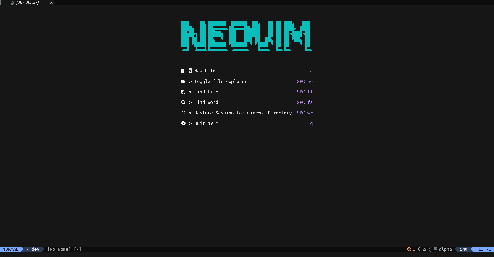
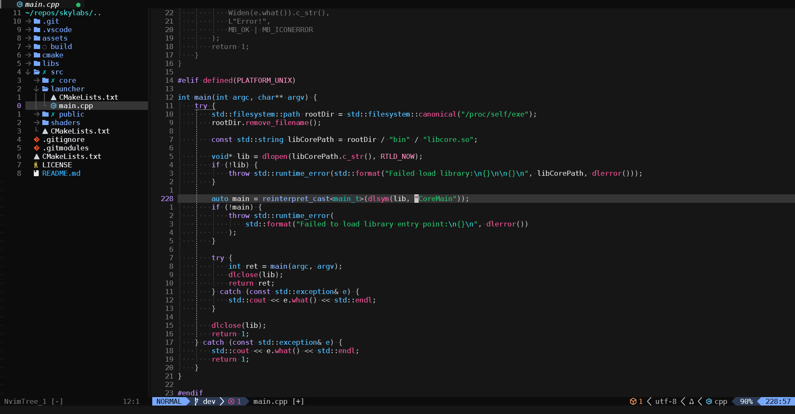

# <p align="center">🌟 Grinlex's Dotfiles</p>

Welcome to my **dotfiles** repository - collection of the most convenient configurations for me, as far as I could make, for programs and Unix-like environments.

## ✨ Features

- **Convinient tab-completion in bash** via `.initrc`  
  Mimics the Windows `cmd` tab-completion behavior: cycle through all files and folders in a directory when pressing tab and without annoying BEEEP sounds.

- **Neovim Power Setup**:
  - 🧠 Language Server Protocol support for **C++** via [`clangd`](https://clangd.llvm.org/)
  - 📁 File explorer with [`nvim-tree`](https://github.com/nvim-tree/nvim-tree.lua)
  - 🌈 Beautiful [Carbonfox](https://github.com/EdenEast/nightfox.nvim?tab=readme-ov-file#carbonfox) theme and intuitive keybindings
  - 🧩 Plugin-managed with [lazy.nvim](https://github.com/folke/lazy.nvim)

### 📸 Neovim preview
<p align="center">
  
</p>

<p align="center">
  
</p>

## 🛠️ Installation
The installation is performed according to the method from [arch linux wiki](https://wiki.archlinux.org/title/Dotfiles#Tracking_dotfiles_directly_with_Git).

```bash
git clone --bare https://github.com/GrinlexGH/.dotfiles.git $HOME/.dotfiles

alias dotfiles='/usr/bin/git --git-dir="$HOME/.dotfiles/" --work-tree="$HOME"'

dotfiles checkout
dotfiles config --local status.showUntrackedFiles no
```

To update, use the following command:

```bash
dotfiles checkout -f
```

## 🤝 Contributions

These dotfiles are tailored for my workflow but feel free to fork or adapt for your own use. PRs and ideas are always welcome!
